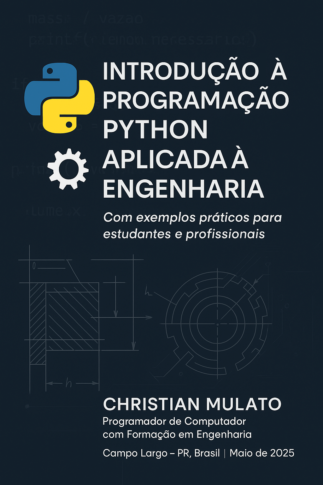

  

# Introdução à Programação Python Aplicada à Engenharia

Este repositório reúne o material do livro **"Introdução à Programação Python Aplicada à Engenharia"**, elaborado por Christian Vladimir Uhdre Mulato, Engenheiro Químico e Desenvolvedor de Sistemas, com apoio da Develcode.

> **Status:** Em processo de compilação da versão final, seguindo rigorosamente o planejamento detalhado no [cronograma de produção](cronograma.md).  
> O conteúdo está sendo revisado, complementado com exemplos, exercícios e imagens, conforme as etapas previstas no cronograma anexo.

## Sobre o Projeto

O objetivo deste material é fornecer uma introdução prática à programação Python voltada para aplicações em engenharia, com exemplos reais, exercícios e explicações acessíveis para estudantes e profissionais da área.

- **Conteúdo original:** Organização, exemplos e exercícios próprios, respeitando direitos autorais e boas práticas acadêmicas.
- **Formato:** Apostila em Markdown, com imagens e figuras.
- **Período de produção:** Maio a julho de 2025.

## Como acompanhar

- Consulte o [cronograma.md](cronograma.md) para acompanhar o andamento dos capítulos e tarefas.
- Sugestões, correções e contribuições são bem-vindas via issues ou pull requests.

---

## Sumário do Conteúdo Desenvolvido

### Título: Introdução à Programação Python Aplicada à Engenharia  
**Autor:** Christian Vladimir Uhdre Mulato  

**Sumário**

1. [Apresentação](python_engenharia.md#1-apresentação)  
2. [Fundamentos da Programação em Python](python_engenharia.md#2-fundamentos-da-programação-em-python)  
   - [2.1. Tipos de Dados em Python](python_engenharia.md#21-tipos-de-dados-em-python)  
   - [2.2. Operadores Aritméticos e Lógicos em Python](python_engenharia.md#22-operadores-aritméticos-e-lógicos-em-python)  
   - [2.3. Entrada e Saída de Dados em Python](python_engenharia.md#23-entrada-e-saída-de-dados-em-python)  
   - [2.4. Primeiros Cálculos Aplicados à Engenharia](python_engenharia.md#24-primeiros-cálculos-aplicados-à-engenharia)  
   - [2.5. Conclusão](python_engenharia.md#25-conclusão)  
3. [Estruturas de Controle](python_engenharia.md#3-estruturas-de-controle)  
   - [3.1. Condicionais: IF, ELIF, ELSE](python_engenharia.md#31-condicionais-if-elif-else)  
   - [3.2. Laços de Repetição: FOR, WHILE](python_engenharia.md#32-laços-de-repetição-for-while)  
   - [3.3. Aplicações Práticas em Verificação de Condições Operacionais](python_engenharia.md#33-aplicações-práticas-em-verificação-de-condições-operacionais)  
   - [3.4. Conclusão](python_engenharia.md#34-conclusão)  
4. [Funções e Modularização](python_engenharia.md#4-funções-e-modularização)  
   - [4.1. Definição de Funções](python_engenharia.md#41-definição-de-funções)  
   - [4.2. Parâmetros e Retorno](python_engenharia.md#42-parâmetros-e-retorno)  
   - [4.3. Organização de Código em Módulos Reutilizáveis](python_engenharia.md#43-organização-de-código-em-módulos-reutilizáveis)  
   - [4.4. Conclusão](python_engenharia.md#44-conclusão)  
5. [Estruturas de Dados](python_engenharia.md#5-estruturas-de-dados)  
   - [5.1. Listas, Tuplas e Dicionários](python_engenharia.md#51-listas-tuplas-e-dicionários)  
   - [5.2. Iteração e Manipulação de Dados](python_engenharia.md#52-iteração-e-manipulação-de-dados)  
   - [5.3. Aplicações em Vetores de Parâmetros de Processo](python_engenharia.md#53-aplicações-em-vetores-de-parâmetros-de-processo)  
   - [5.4. Conclusão](python_engenharia.md#54-conclusão)  
6. [Manipulação de Arquivos e Dados](python_engenharia.md#6-manipulação-de-arquivos-e-dados)  
   - [6.1. Leitura e Escrita de Arquivos .txt e .csv](python_engenharia.md#61-leitura-e-escrita-de-arquivos-txt-e-csv)  
   - [6.2. Introdução à Biblioteca Pandas](python_engenharia.md#62-introdução-à-biblioteca-pandas)  
   - [6.3. Análise de Dados Experimentais e Simulações Computacionais](python_engenharia.md#63-análise-de-dados-experimentais-e-simulações-computacionais)  
   - [6.4. Conclusão](python_engenharia.md#64-conclusão)  
7. [Visualização de Dados](python_engenharia.md#7-visualização-de-dados)  
   - [7.1. Matplotlib e Seaborn: Ferramentas Essenciais para Visualização de Dados em Python](python_engenharia.md#71-mat_plot_lib-e-seaborn-ferramentas-essenciais-para-visualização-de-dados-em-python)  
   - [7.2. Tipos de Gráficos: Escolhendo a Representação Visual Adequada](python_engenharia.md#72-tipos-de-gráficos-escolhendo-a-representação-visual-adequada)  
   - [7.3. Visualização de Curvas e Resultado de Processos](python_engenharia.md#73-visualização-de-curvas-e-resultado-de-processos)  
   - [7.4. Conclusão](python_engenharia.md#74-conclusão)  
8. [Cálculo Numérico com Numpy](python_engenharia.md#8-cálculo-numérico-com-numpy)  
   - [8.1. Arrays e Operações Vetoriais](python_engenharia.md#81-arrays-e-operações-vetoriais)  
   - [8.2. Matrizes e Álgebra Linear](python_engenharia.md#82-matrizes-e-álgebra-linear)  
   - [8.3. Aplicações em Balanços e Sistemas Lineares](python_engenharia.md#83-aplicações-em-balanços-e-sistemas-lineares)  
   - [8.4. Conclusão](python_engenharia.md#84-conclusão)  
9. [Modelagem Matemática Simples](python_engenharia.md#9-modelagem-matemática-simples)  
   - [9.1. Equações Algébricas e Sistemas Lineares](python_engenharia.md#91-equações-algébricas-e-sistemas-lineares)  
   - [9.2. Equações Diferenciais Ordinárias (EDOs)](python_engenharia.md#92-equações-diferenciais-ordinárias-edos)  
   - [9.3. Simulações de Tanques, Reatores e Processos Dinâmicos](python_engenharia.md#93-simulações-de-tanques-reatores-e-processos-dinâmicos)  
   - [9.4. Otimização de Funções com scipy.optimize](python_engenharia.md#94-otimização-de-funções-com-scipyoptimize)  
   - [9.5. Conclusão](python_engenharia.md#95-conclusão)  
10. [Mini Projetos Aplicados à Engenharia](python_engenharia.md#10-mini-projetos-aplicados-à-engenharia)  
    - [10.1. Estudo de Caso: Tanque com Entrada e Saída](python_engenharia.md#101-estudo-de-caso-tanque-com-entrada-e-saída)  
    - [10.2. Balanço de Massa e Energia com Dados Reais ou Simulados](python_engenharia.md#102-balanço-de-massa-e-energia-com-dados-reais-ou-simulados)  
    - [10.3. Integração de Módulos Anteriores em Soluções Práticas](python_engenharia.md#103-integração-de-módulos-anteriores-em-soluções-práticas)  
    - [10.4. Conclusão](python_engenharia.md#104-conclusão)  
11. [Finalização e Agradecimentos](python_engenharia.md#11-finalização-e-agradecimentos)  
12. [Configuração do Ambiente Python e VS Code](python_engenharia.md#12-configuração-do-ambiente-python-e-vs-code)  
    - [12.1. Python](python_engenharia.md#121-python)  
    - [12.2. Visual Studio Code (VS Code)](python_engenharia.md#122-visual-studio-code-vs-code)  
13. [Referências Bibliográficas](python_engenharia.md#13-referências-bibliográficas)  

---

Campo Largo – PR, junho de 2025

**Christian Vladimir Uhdre Mulato**  
Engenheiro Químico e Desenvolvedor de Sistemas  
Apoio: Develcode – Consultoria em Tecnologia